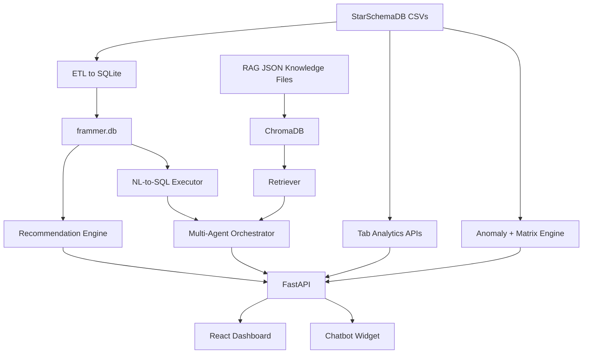
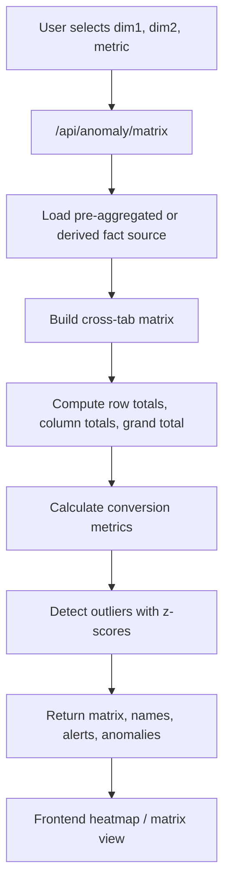
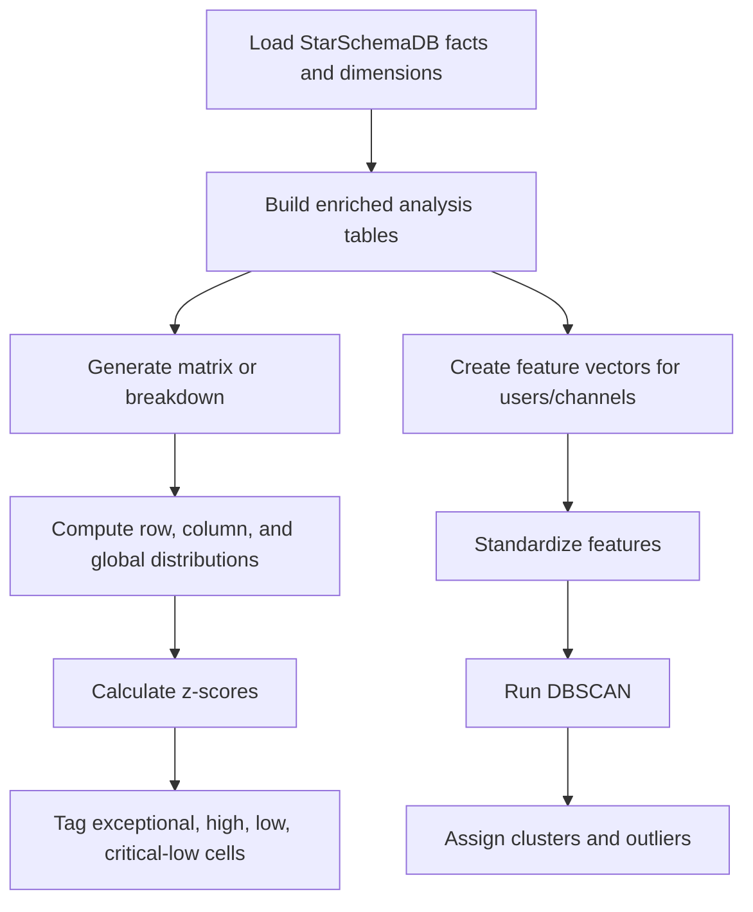
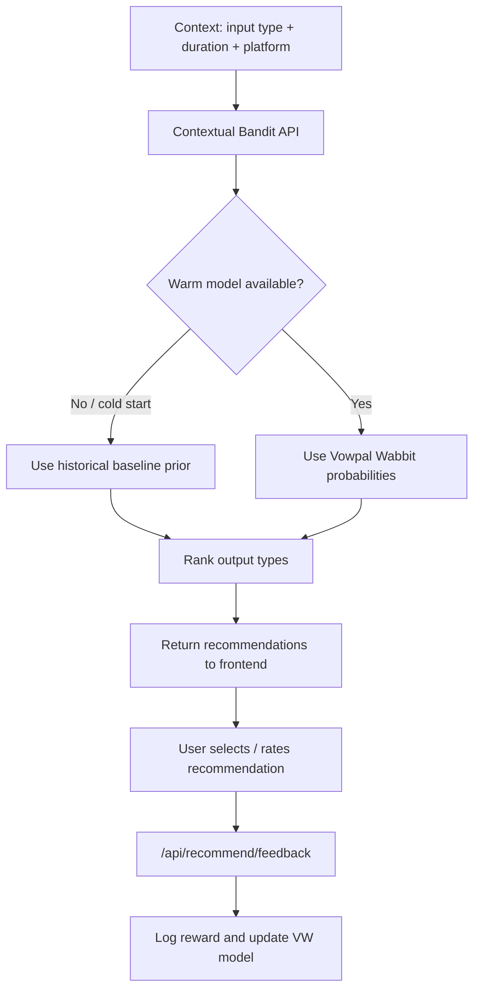
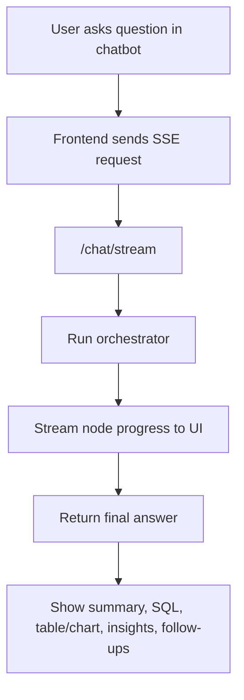
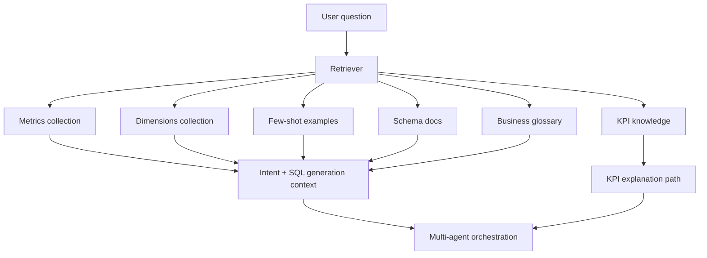
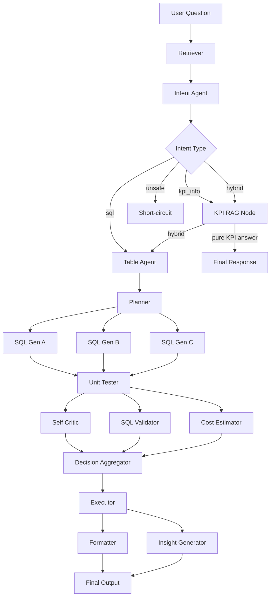

# Frammer AI Product Usage Analytics Dashboard

End-to-end analytics solution built for **General Championship - Data Analytics (2026)** in response to the Frammer AI problem statement: designing a scalable, modular, insight-ready dashboard for media operations, with multi-dimensional analysis, actionable recommendations, anomaly detection, and a natural-language analytics assistant.

## 1. Problem Statement Alignment

Frammer AI needed a browser-based analytics solution that could:

- track uploaded, processed, and published content clearly
- support leadership, operations, editorial, client success, and product teams
- handle multi-client, multi-channel, multi-user, multi-language usage patterns
- enable multi-dimensional drilldowns
- surface insights, bottlenecks, anomalies, and recommendations
- support natural-language querying using retrieval and semantic context
- remain extensible as new KPIs, dimensions, and reporting layers are added

This repository implements that solution as a **React frontend + FastAPI backend + star-schema analytical model + SQLite warehouse + ChromaDB RAG layer + multi-agent NL-to-SQL pipeline**.

## 2. Solution Overview

At a high level, the solution has 5 layers:

1. **Data layer**  
   Source CSVs are organized in a star-schema style under `StarSchemaDB/`.

2. **Warehouse layer**  
   The CSV model is loaded into `backend/data/frammer.db` using `backend/scripts/etl_to_sqlite.py`.

3. **Analytics/API layer**  
   FastAPI serves tab-wise analytics, anomaly detection, recommendations, and chatbot endpoints.

4. **Intelligence layer**  
   A multi-agent NL-to-SQL orchestrator combines retrieval, intent classification, SQL generation, validation, execution, formatting, and insight generation.

5. **Experience layer**  
   A React dashboard provides five business tabs plus an always-on chatbot widget.

## 3. Tech Stack

### Frontend

- React
- React Router
- Recharts
- Lucide Icons

### Backend

- FastAPI
- Pandas / NumPy
- scikit-learn
- LangChain / LangGraph
- OpenAI-compatible LLM calls via `langchain-openai`
- ChromaDB
- sentence-transformers (`BAAI/bge-small-en-v1.5`)
- SQLite
- Vowpal Wabbit

## 4. Repository Structure

```text
GCData_Analytics/
├── frontend/                 # React application
├── backend/                  # FastAPI app, agents, RAG, ETL, analytics APIs
├── StarSchemaDB/             # Star-schema CSV model
├── Dataset/                  # Raw/working datasets and intermediate exports
├── Dockerfile                # Multi-stage Docker build for backend
├── requirements.txt          # General/root Python dependencies
└── README.md
```

## 5. Overall Product Walkthrough

The intended user journey is:

1. Open the dashboard home page and choose a business tab.
2. Start with high-level KPI monitoring in the summary view.
3. Move into time trends and operational health.
4. Drill down into user/channel behavior.
5. Investigate multidimensional intersections and anomalies.
6. Use the funnel tab for advanced KPI interpretation and recommendations.
7. Use the explorer tab for video-level investigation and exports.
8. Ask plain-English questions to the chatbot for ad hoc analysis.

## 6. Application Architecture



## 7. Tab-Wise Walkthrough

The UI exposes five business tabs from the home screen.

### Tab 1: Summary

Frontend: `frontend/src/AnalyticsOverview.js`  
Backend: `backend/tab1_analytics.py`  
API prefix: `/api/tab1`

Purpose:

- executive monitoring
- MoM KPI movement
- top-of-funnel to publish-funnel visibility
- high-level alerts

Main outputs:

- top 10 KPI cards
- monthly trend of uploaded, created, published content
- publishing funnel
- input type breakdown
- output type breakdown
- platform ranking
- top channels
- language analysis
- user activity summary
- auto-generated alerts

Best suited for:

- founders and leadership
- client success
- operations monitoring

### Tab 2: Trends

Frontend: `frontend/src/ProjectsDashboard.js`  
Backend: `backend/tab2_analytics.py`  
API prefix: `/api/tab2`

Purpose:

- deep trend exploration across the last 12 months
- efficiency, duration, adoption, diversity, and metadata quality tracking

The implementation includes 12 analytical sub-sections:

- Overview
- Editorial Yield
- Publishing Ecosystem
- Output Generation Rate
- Monthly Productivity Index
- Duration Footprint
- Metadata Health
- Platform Adoption Velocity
- Usage Intensity Score
- Channel Productivity
- Output Diversity
- Content Impact

Best suited for:

- ops teams
- product teams
- editorial strategy reviews

### Tab 3: Analysis

Frontend: `frontend/src/AnalyticsDashboard.js`  
Backend: `backend/tab3_analytics.py`  
API prefix: `/api/tab3`

Purpose:

- behavior-level analysis across users and channels
- performance ranking and operational segmentation
- multidimensional and anomaly investigations

Sub-sections:

- User Analysis
- Channel Analysis
- Multidimension & Anomaly

User Analysis includes:

- active user KPIs
- repeatability rate
- contribution concentration
- loyalty tiers
- leaderboard
- publish-rate comparisons

Channel Analysis includes:

- publishing channel coverage
- best-performing channel
- creation efficiency
- per-channel user contribution

### Tab 4: Funnel

Frontend: `frontend/src/ExecutiveSummary.js`  
Backend: `backend/tab4_kpis.py` + `backend/recommendation.py`  
API prefixes: `/api/tab4`, `/api/recommend`

Purpose:

- advanced KPI interpretation
- mix health measurement
- diversity and concentration analysis
- recommendation support

Key KPI families:

- Content Efficiency Index
- Duration Amplification Ratio
- Input Mix Health
- Output Mix Health
- Platform Diversity Index
- Channel Gini Coefficient
- Latency metrics
- Consistency Index

This tab also connects to the recommendation engine.

### Tab 5: Explorer

Frontend: `frontend/src/VideoExplorer.js`  
Backend: `backend/tab5_explorer.py`  
API prefix: `/api/tab5`

Purpose:

- video-level exploration and governance
- search, filtering, and export
- granular troubleshooting

Main capabilities:

- paginated searchable table
- status filtering
- team/user/platform/output-type filtering
- summary cards
- charts
- insights
- CSV export

Best suited for:

- operations
- editorial QA
- data validation
- client/account review

## 8. Multi-Dimensional Matrix Workflow

The multidimensional engine supports `dimension 1 x dimension 2` analysis across combinations such as:

- Channel x User
- Channel x Platform
- User x Month
- Channel x Month
- Channel x Input Type
- User x Input Type
- Team x Platform
- Language x Channel
- Output Type x User

Supported metrics include:

- count
- duration
- conversion

### Workflow



Implementation notes:

- if a direct fact table exists, it uses it
- if only partial aggregates exist, it proportionally derives the matrix
- if unsupported, the API returns a safe empty response instead of failing

## 9. Anomaly Detection Workflow

Backend file: `backend/multidimension_anomaly.py`

The anomaly layer identifies unusually high or low intersections and also clusters similar users/channels.

### Methods used

- **Z-score anomaly detection** for matrix cells and row totals
- **DBSCAN clustering** for behavioral grouping and outlier detection

### Workflow



Outputs exposed by API:

- dimensions
- aggregate KPIs
- matrix
- clusters
- dimension breakdown

## 10. Recommendation Engine Workflow

Backend files:

- `backend/recommendation.py`
- `backend/scripts/vw_bandit_service.py`
- `backend/scripts/build_baseline_model.py`

Purpose:

- recommend the best output format for a given input context
- learn from user feedback over time

Input context currently uses:

- input type
- duration bucket
- platform

Actions currently map to output types such as:

- Full Package
- Key Moments
- Chapters
- My Key Moments
- Summary

### Workflow



Design logic:

- **cold start** is handled using historical output-type priors from the warehouse
- **online learning** happens through feedback logging
- recommendations become more context-aware as interaction history grows

## 11. Chatbot Workflow

Frontend file: `frontend/src/ChatbotWidget.js`  
Backend entrypoints: `POST /chat`, `POST /chat/stream`, `POST /query`, `POST /query/stream`

The chatbot is an always-on natural-language analytics layer that can:

- answer KPI definition questions
- answer warehouse-backed analytical questions
- stream progress across pipeline steps
- return SQL
- return chart-ready data
- return insights and follow-up prompts

### Workflow



The chatbot UI also shows:

- generated SQL
- query results in chart/table form
- unit tester comparison
- token/cost and latency
- session history

## 12. RAG Workflow

The project does not use RAG only for document Q&A. It uses RAG to improve **analytics understanding**, **KPI explanation**, and **query grounding**.

Primary files:

- `backend/RAG/knowledge_base.py`
- `backend/RAG/retriever.py`
- `backend/RAG/metric_definitions.json`
- `backend/RAG/dimension_definitions.json`
- `backend/RAG/few_shot_examples.json`
- `backend/RAG/schema_docs.json`
- `backend/RAG/kpi_registry.json`
- `backend/RAG/tab_context.json`
- `backend/RAG/business_glossary.json`

### What is embedded

- metric definitions
- dimension definitions
- few-shot NL-to-SQL examples
- schema docs
- KPI knowledge
- tab context
- business glossary / jargon

### RAG Workflow



### Why this matters

- improves semantic mapping from business language to schema
- supports non-technical users
- handles KPI definition questions without unnecessary SQL
- makes the system more explainable by showing which tab/KPI context was used

## 13. Multi-Agent NL-to-SQL Workflow

Backend file: `backend/orchestrator.py`

The orchestrator is the intelligence core of the system.

### Pipeline stages

1. Retriever
2. Intent Agent
3. KPI RAG branch or SQL branch
4. Table Agent
5. Planner Agent
6. Three parallel SQL generators
7. Unit Tester
8. Self Critic, SQL Validator, Cost Estimator
9. Decision Aggregator
10. Executor
11. Formatter and Insight Generator
12. Final response

### Workflow



## 14. Star Schema

The analytical model is centered on reusable dimension tables and fact tables stored in `StarSchemaDB/`, then mirrored into SQLite.

### Dimensions

- `Dim_Channel`
- `Dim_User`
- `Dim_Input_Type`
- `Dim_Output_Type`
- `Dim_Language`
- `Dim_Platform`
- `Dim_Team`
- `Dim_Month`

### Facts

- `Fact_Video`
- `Fact_User_Channel`
- `Fact_User_Summary`
- `Fact_Monthly`
- `Fact_Channel_Publishing`
- `Fact_Input_Type`
- `Fact_Language`
- `Fact_Output_Type`
- `Fact_User_Monthly`

### Logical Mermaid ER Diagram

Note: the SQLite export does not declare formal foreign keys, but the relationships below are the logical model used by the application.

```mermaid
erDiagram
    DIM_USER {
        int user_id
        string user_name
    }
    DIM_CHANNEL {
        int channel_id
        string channel_name
    }
    DIM_INPUT_TYPE {
        int inputtype_id
        string input_type_name
    }
    DIM_OUTPUT_TYPE {
        int outputtype_id
        string output_type_name
    }
    DIM_LANGUAGE {
        int language_id
        string language_name
    }
    DIM_PLATFORM {
        int platform_id
        string platform_name
    }
    DIM_TEAM {
        int team_id
        string team_name
    }
    DIM_MONTH {
        int month_id
        string month_name
        int month_num
        int year
        int quarter
    }

    FACT_VIDEO {
        int video_id
        string headline
        string source
        int published
        string type
        int user_id
        int team_id
        int platform_id
        int inputtype_id
        string published_url
    }
    FACT_USER_SUMMARY {
        int user_id
        int uploaded_count
        int created_count
        int published_count
    }
    FACT_USER_CHANNEL {
        int user_id
        int channel_id
        int uploaded_count
        int created_count
        int published_count
    }
    FACT_MONTHLY {
        int month_id
        int total_uploaded
        int total_created
        int total_published
    }
    FACT_CHANNEL_PUBLISHING {
        int channel_id
        int platform_id
        int published_count
        int published_duration
    }
    FACT_INPUT_TYPE {
        int inputtype_id
        int uploaded_count
        int created_count
        int published_count
    }
    FACT_OUTPUT_TYPE {
        int outputtype_id
        int uploaded_count
        int created_count
        int published_count
    }
    FACT_LANGUAGE {
        int language_id
        int uploaded_count
        int created_count
        int published_count
    }
    FACT_USER_MONTHLY {
        int user_id
        int month_id
        int uploaded_count
        int created_count
        int published_count
    }

    DIM_USER ||--o{ FACT_VIDEO : user_id
    DIM_TEAM ||--o{ FACT_VIDEO : team_id
    DIM_PLATFORM ||--o{ FACT_VIDEO : platform_id
    DIM_INPUT_TYPE ||--o{ FACT_VIDEO : inputtype_id

    DIM_USER ||--o{ FACT_USER_SUMMARY : user_id
    DIM_USER ||--o{ FACT_USER_CHANNEL : user_id
    DIM_CHANNEL ||--o{ FACT_USER_CHANNEL : channel_id

    DIM_MONTH ||--o{ FACT_MONTHLY : month_id
    DIM_CHANNEL ||--o{ FACT_CHANNEL_PUBLISHING : channel_id
    DIM_PLATFORM ||--o{ FACT_CHANNEL_PUBLISHING : platform_id

    DIM_INPUT_TYPE ||--o{ FACT_INPUT_TYPE : inputtype_id
    DIM_OUTPUT_TYPE ||--o{ FACT_OUTPUT_TYPE : outputtype_id
    DIM_LANGUAGE ||--o{ FACT_LANGUAGE : language_id

    DIM_USER ||--o{ FACT_USER_MONTHLY : user_id
    DIM_MONTH ||--o{ FACT_USER_MONTHLY : month_id
```



## 15. Key Metric Themes

Across the product, the dashboard emphasizes:

- upload volume
- created/processed volume
- published volume
- publish conversion
- content expansion
- orphan/wastage rate
- channel concentration
- platform diversity
- output diversity
- input diversity
- latency
- consistency
- user loyalty and productivity
- metadata quality

## 16. API Summary

### Core chatbot/NLQ

- `GET /health`
- `POST /query`
- `POST /chat`
- `POST /query/stream`
- `POST /chat/stream`

### Dashboard APIs

- `/api/tab1/*`
- `/api/tab2/all`
- `/api/tab3/all`
- `/api/tab4/kpis`
- `/api/tab5/*`

### Intelligence APIs

- `/api/anomaly/*`
- `/api/recommend/*`

## 17. Installation and Setup

## Prerequisites

- Python 3.10+
- Node.js 18+
- npm

## Backend Setup

```bash
python3 -m venv .venv
source .venv/bin/activate
pip install -r backend/requirements.txt
pip install -r requirements.txt
pip install chromadb
```

### Environment variables

Create a `.env` file in `backend/` with at least:

```env
OPENAI_API_KEY=your_key_here
```

Create a `.env` file in `frontend/` with:

```env
REACT_APP_API_URL=http://localhost:8000
```

All frontend API calls read from `REACT_APP_API_URL`. For production, set this to your deployed backend URL (e.g., your Cloud Run URL).

## Build the Warehouse

Run ETL to create `backend/data/frammer.db` and schema metadata:

```bash
python backend/scripts/etl_to_sqlite.py
```

## Build the Knowledge Base

Create the Chroma collections used by RAG:

```bash
python backend/RAG/knowledge_base.py --verify
python backend/RAG/load_jargon_data.py
```

## Build the Recommendation Baseline

Initialize the historical prior used by the recommendation engine:

```bash
python backend/scripts/build_baseline_model.py
```

## Start the Backend

```bash
cd backend
uvicorn main:app --reload --host 0.0.0.0 --port 8000
```

Backend docs:

- Swagger UI: [http://localhost:8000/docs](http://localhost:8000/docs)

## Start the Frontend

In a new terminal:

```bash
cd frontend
npm install
npm start
```

Frontend app:

- [http://localhost:3000](http://localhost:3000)

## 18. Recommended First Run Order

```bash
python3 -m venv .venv
source .venv/bin/activate
pip install -r backend/requirements.txt
pip install -r requirements.txt
pip install chromadb
python backend/scripts/etl_to_sqlite.py
python backend/RAG/knowledge_base.py --verify
python backend/RAG/load_jargon_data.py
python backend/scripts/build_baseline_model.py
cd backend && uvicorn main:app --reload --port 8000
cd frontend && npm install && npm start
```

## 19. Troubleshooting

### `chromadb` import error

Install it manually:

```bash
pip install chromadb
```

### Chatbot works but pages fail to load

Make sure backend is running specifically on:

- `http://localhost:8000`

### Recommendation service unavailable

Run:

```bash
python backend/scripts/build_baseline_model.py
```

### RAG returns weak or empty answers

Rebuild the vector store:

```bash
python backend/RAG/knowledge_base.py --verify
python backend/RAG/load_jargon_data.py
```

## 20. Deployment

### Backend — Docker + Google Cloud Run

The backend is containerized and deployed to GCP Cloud Run.

```bash
# Build the Docker image (use linux/amd64 for Cloud Run)
docker build --platform linux/amd64 -t gcdata-backend .

# Tag and push to Artifact Registry
docker tag gcdata-backend us-central1-docker.pkg.dev/YOUR_PROJECT_ID/YOUR_REPO/gcdata-backend:latest
docker push us-central1-docker.pkg.dev/YOUR_PROJECT_ID/YOUR_REPO/gcdata-backend:latest
```

Then deploy via the Cloud Run console or CLI:

```bash
gcloud run deploy gcdata-backend \
  --image us-central1-docker.pkg.dev/YOUR_PROJECT_ID/YOUR_REPO/gcdata-backend:latest \
  --platform managed \
  --region us-central1 \
  --allow-unauthenticated \
  --port 8080 \
  --update-env-vars="OPENAI_API_KEY=your_key_here"
```

### Frontend — Vercel

The React frontend is deployed on Vercel.

1. Import the GitHub repository on [vercel.com](https://vercel.com).
2. Set **Root Directory** to `frontend`.
3. Set **Framework Preset** to `Create React App`.
4. Add environment variables:
   - `REACT_APP_API_URL` = your Cloud Run backend URL
   - `CI` = `false`
5. Deploy.

## 21. Why This Solution Is Strong for the Case

This solution directly addresses the Frammer AI brief by combining:

- leadership-ready KPIs
- clear overview-to-detail navigation
- modular tab-wise APIs
- multi-dimensional drilldowns
- anomaly detection and clustering
- recommendation support
- video-level traceability
- natural-language analytics with RAG and explainable routing
- a scalable star-schema foundation for future metrics and dimensions

---

If you are evaluating this project against the case brief, the best demo flow is:

1. Start with **Summary**
2. Move to **Trends**
3. Show **User/Channel Analysis**
4. Demonstrate **Multidimension & Anomaly**
5. Explain **Funnel KPIs + Recommendations**
6. Finish with **Explorer**
7. Ask a few business questions in the **chatbot**
